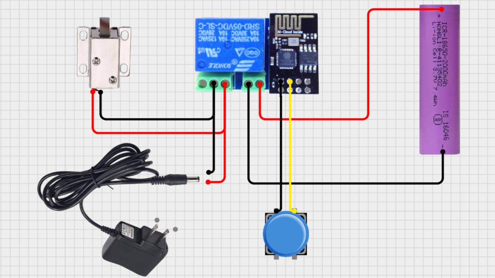
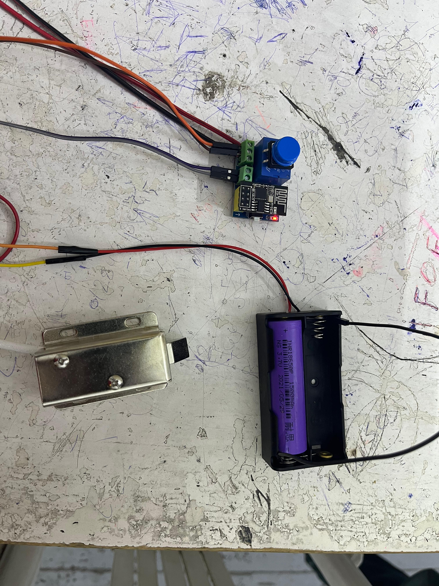
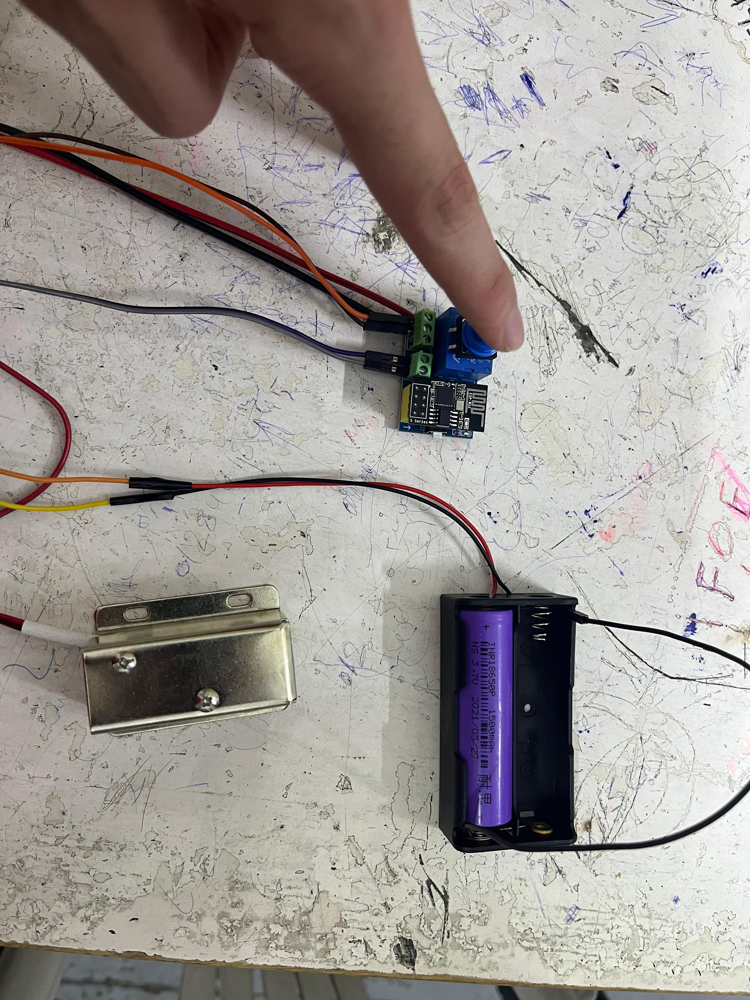

# Smart Door Lock

The **Smart Door Lock** is an IoT-based access control system that provides both manual and remote operation of a solenoid door lock. Designed with flexibility and security in mind, it leverages cloud communication and local input to ensure users can access their space regardless of network conditions.

---

## 📸 Images

| Smart Door Lock Circuit | Prototype (OFF) | Prototype (ON) |
|--------------------------|------------------|-----------------|
|  |  |  |

---

## 🔐 Use Case

The **Smart Door Lock** provides secure access control through:
- **Remote unlocking** using mobile apps or dashboards via Wi-Fi and Firebase.
- **Local manual override** using a pushbutton in case of no network availability.

The system is ideal for smart homes, secure office entry systems, or lockers requiring both flexibility and reliability in access.

---

## 🛠️ Hardware Components and Justification

| Component                  | Purpose & Justification                                                                 |
|---------------------------|------------------------------------------------------------------------------------------|
| ESP-01S Relay Module       | Controls the switching logic and manages Wi-Fi connectivity.                            |
| 12V Solenoid Lock          | Physically locks/unlocks the door based on relay signals.                              |
| Pushbutton (GPIO2)         | Offers manual override for local door unlocking.                                       |
| 12V DC Adapter             | Powers the solenoid lock due to its higher current requirements.                        |
| 3.7V 18650 Li-ion Battery  | Supplies low-power operation to the control circuitry (ESP-01S).                        |
| Compact PCB (optional)     | Simplifies and stabilizes the wiring for a more robust and portable prototype.          |

---

## 💻 Software Overview

- **Language**: C++  
- **Platform**: Arduino IDE  
- **Cloud Backend**: Firebase  
- **Library Used**: [Firebase ESP Client Library](https://github.com/mobizt/Firebase-ESP-Client)

The ESP-01S firmware is programmed to:
- Send and receive lock status via Firebase.
- Unlock the door based on pushbutton press or remote Firebase commands.
- Maintain lock integrity and reduce false triggers.

---

## 🚀 Features

- 🔐 Secure **wireless control** of door locks via app/web
- 🔘 Local **pushbutton override** for manual access
- 🔌 **Relay-controlled** solenoid integration
- 📶 Real-time **Firebase** communication
- 🔋 Portable design with **battery-powered control**

---

## 🔧 Future Enhancements

- Add OTP or keypad support for multi-factor access
- Integrate RFID or biometric modules
- Add alert system for unauthorized access attempts
- Add lock status feedback via LED or buzzer

---

## 👤 Developed By

Mohamed Mostafa  
**IoT Engineer**

---
